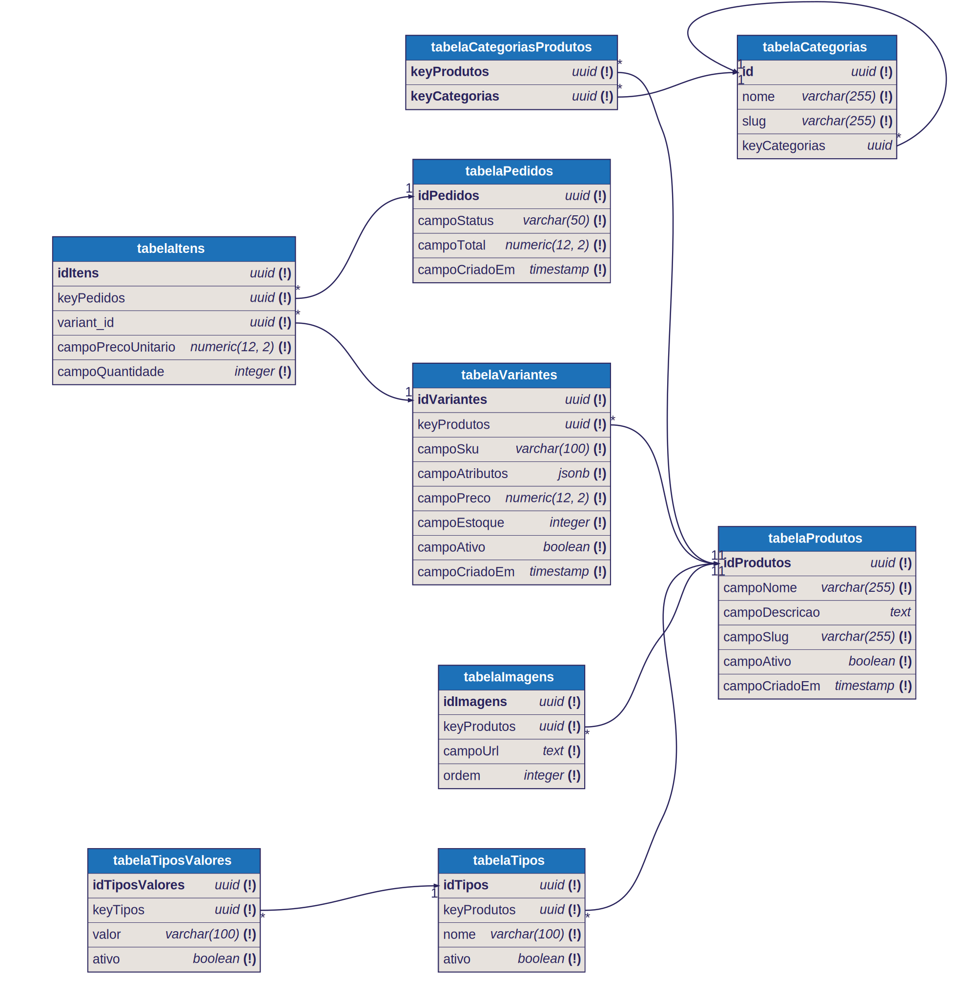

# MODELO DE ECOMMERCE

## ERD



## INSTALAÇÃO DE PACOTES

```bash
npm install
```

## ARQUIVO .env

Copie o conteúdo do arquivo _.env.example_ para um arquivo novo _.env_.

## RODAR EM MODO DESENVOLVIMENTO

```sh
npm run dev
```

## ACESSO EM MODO DE DESENVOLVIMENTO

Acesse [https://localhost:5173/admin](https://localhost:5173/admin/) no navegador.

## MODO PRODUÇÃO

```sh
npm run build
npm run preview
```
